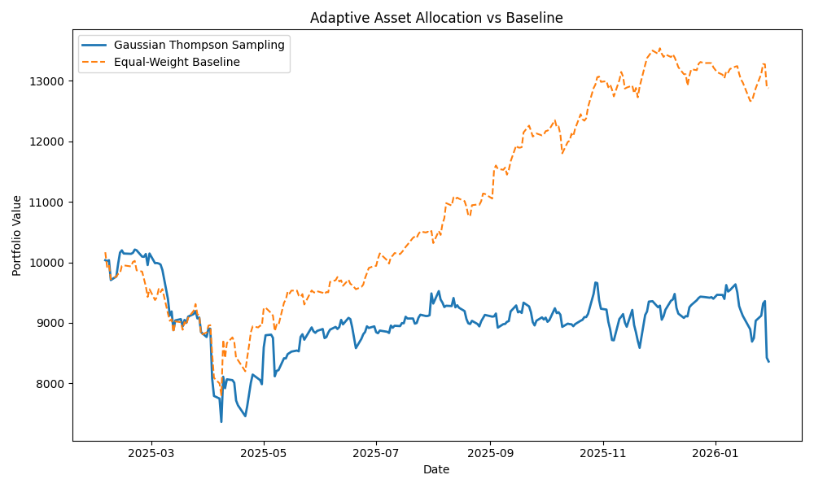

## Adaptive Asset Allocation


Comparison of portfolio value over time for the Gaussian Thompson Sampling strategy versus an equal-weight baseline.

A paper-trading system that uses a bandit-based strategy to dynamically allocate capital across multiple assets using historical market data.

This project started as a personal experiment to understand whether simple reinforcement learning techniques can outperform static allocation strategies in noisy, real-world financial data.

---

## What this project does
Given a set of assets and historical price data, the system:
- Ingests daily closing prices into a local SQL database
- Computes daily returns
- Uses a Gaussian Thompson Sampling strategy to decide which asset to allocate capital to each day
- Simulates portfolio growth over time
- Evaluates performance using standard financial metrics
- Exposes the current allocation decision through a lightweight API
Everything is designed to stay simple and inspectable.

## Why a bandit approach
Asset allocation is fundamentally a resource allocation problem under uncertainty.
Multi-Armed Bandit algorithms are a natural fit because they balance:
- Exploration: trying assets with uncertain performance
- Exploitation: allocating more capital to assets that have performed well
Unlike deep reinforcement learning, bandits work well with limited data and are easier to reason about and debug.

## Why Gaussian Thompson Sampling
Standard Thompson Sampling is often presented using Bernoulli rewards (0 or 1).
That assumption does not hold for financial returns, which are:
- Continuous
- Often negative
- Small in magnitude
This project uses Gaussian Thompson Sampling, which models each asset’s returns as a normal distribution and samples from the estimated mean to guide decisions.

To keep the implementation stable and interpretable, variance is treated as fixed and the mean is updated incrementally. This keeps the learning behavior easy to reason about and avoids overfitting on limited data.

---

## Baseline Comparison

To evaluate whether the adaptive strategy adds value, I compare the
Gaussian Thompson Sampling policy against a simple equal-weight baseline
using the same historical returns.

Both strategies are simulated over identical market conditions. The
baseline allocates capital evenly across all assets, while the bandit
adapts allocations based on observed returns.

This provides a controlled comparison of adaptive versus static
allocation without introducing additional assumptions.


## Project structure
```text
adaptive-asset-allocation/
├── config.yaml
├── data/
├── src/
│   ├── ingest_data.py
│   ├── bandit.py
│   ├── simulator.py
│   ├── metrics.py
│   └── api.py
├── tests/
│   ├── conftest.py
│   └── test_bandit.py
├── Dockerfile
├── requirements.txt
└── README.md
```
data/ is created locally during ingestion and is intentionally not committed to version control.

---

## How to run locally
1. Install dependencies
```bash
python -m venv venv
source venv/bin/activate
pip install -r requirements.txt
```

2. Configure assets
Edit config.yaml:
```bash
assets:
  - AAPL
  - GOOGL
  - MSFT
lookback_period: 365
initial_capital: 10000
```

3. Ingest price data
```bash
python src/ingest_data.py
```
This creates data/prices.db locally

4. Run backtest
```bash
python -m src.simulator
```
This prints cumulative return, max drawdown, and Sharpe ratio for the run.

## API usage
Start the service:
```bash
uvicorn src.api:app --reload
```

Request current allocation:
```nginx
GET http://127.0.0.1:8000/allocation
```

## Example response:
(values will vary as the sampler explores)
```bash
{
  "weights": {
    "AAPL": 0.43,
    "GOOGL": 0.57,
    "MSFT": 0.0
  }
}
```

## Running with Docker
Build the image:
```bash
docker build -t adaptive-asset-allocation .
```

Run the container:
```bash
docker run -p 8000:8000 adaptive-asset-allocation
```

Then access:
```bash
http://127.0.0.1:8000/allocation
```

## Testing
A minimal unit test is included to verify that the bandit updates its estimated mean after receiving rewards.

Run tests:
```bash
pytest
```

---

## Limitations
- This is paper trading only. No live market execution.
- Transaction costs and slippage are not modeled.
- Volatility is simplified to keep the learning logic transparent.
- The API does not persist state across restarts.
These tradeoffs are intentional to keep the system readable and debuggable.

---

## Future ideas
- Compare against fixed-weight baselines
- Persist bandit state across sessions
- Add basic experiment logging
- Extend to contextual bandits using market features

---

## Final note
This project is meant to be small, practical, and honest.
It prioritizes correctness and clarity over complexity or flashiness.